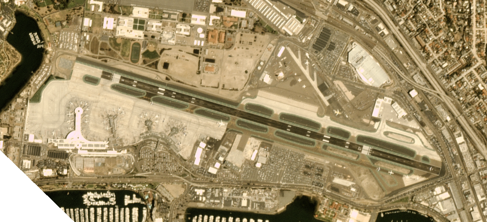
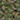
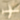
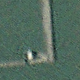
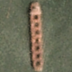
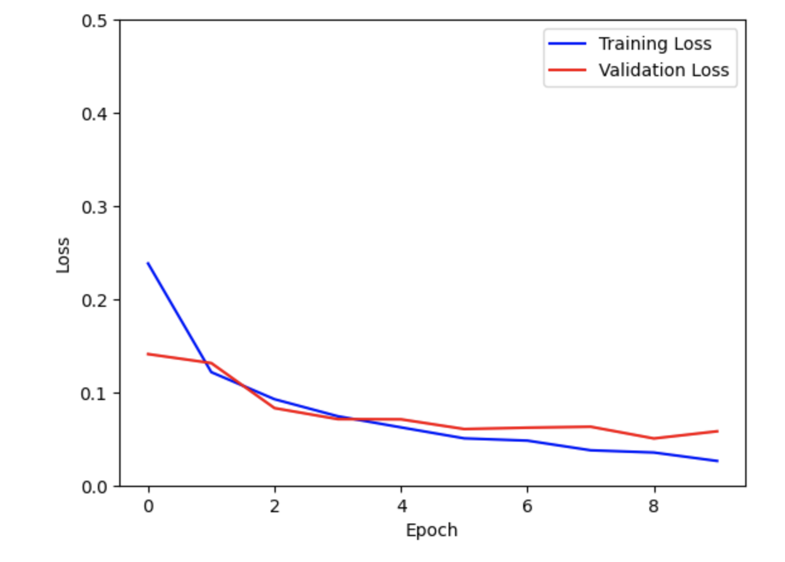
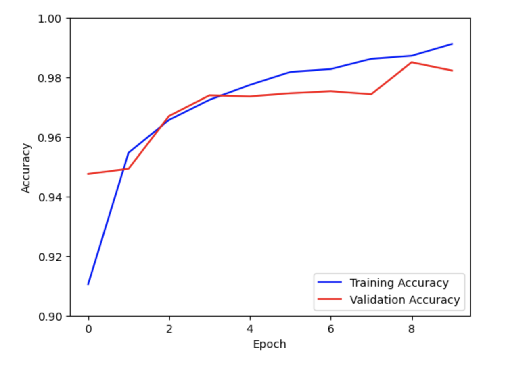

# Detecting Planes and Ships in Satellite Images using a CNN

by Pablo Valencia  
May 4, 2023

## Introduction

Computer vision has been a subject of study for about 60 years. However, it was only recently that architectures capable
of classifying images with high accuracy were developed. Simple Neural Networks were initially appealing for this task,
but it soon became clear that this architecture was not scalable due to the nature of images. High-quality images can
have thousands of pixels, and each pixel can have multiple channels, making each operation highly inefficient.
Convolutional Neural Networks became the preferred architecture for this problem since they can extract meaningful and
low-dimensional features, solving the previous issue.

Yann Le Cun was one of the pioneers in the field of Convolutional Neural Networks. The architecture he proposed was
based on simple neural networks, but with certain operations that could reduce the dimensions of the images while
preserving meaningful data that could be fed to the neural network component. Convolutions are performed on each image
using filters, and the results then go through an activation function and a pooling operation, which reduces the size
of the features.

In recent years, more complex architectures have been developed to improve performance by going deeper. Some of these
architectures include AlexNet, VGGNet, GoogLeNet, ResNet, and DenseNet. [1]


Figure 1. LeNet and AlexNet Architectures

### Problem

Satellite images are collected by satellites operated by governments and companies. These images are among the most
powerful tools for monitoring the Earth, including changes to the physical environment and human activity. They have
numerous applications, including meteorology, fishing, agriculture, mapping, warfare, and intelligence. [2] 
Detecting certain objects from satellite images can be useful for multiple purposes; however, it can be a complex
problem. To mention a few challenges:

1. **Relative size of the object:** Satellite images can be huge, and it can be difficult to detect a specific object, 
especially if it is done manually.
2. **Image quality:** The more pixels an image has, the better its quality. However, some objects may only use a small
number of pixels in comparison to the original size of the satellite image.
3. **Object orientation:** An object can have multiple orientations in an image, making it more difficult to detect.

### Objective

The objective of this project is to build a Convolutional Neural Network model that can predict with high accuracy
whether a given satellite image shows a plane, a ship, or something else entirely.

## Dataset

Two different datasets are being used for this project: "Planes in Satellite Imagery" [3] and "Ships in Satellite 
Imagery". [4] Both of these datasets are available through Planet's Open California dataset and are licensed under
CC BY-SA 4.0.

### Planes in Satellite Imagery

This dataset consists of 32,000 20x20 RGB images of multiple airports in California. Of these images, 8,000 include a 
visible airplane with wings, tail, and nose. The dataset includes different aircraft models, orientations, and atmospheric
conditions. One-third of the remaining 24,000 images show various land cover features. The next third includes partial 
images of airplanes, and the final third includes images that were mislabeled by other machine learning models.


Figure 2. Example of airport satellite image


Figure 3. Dataset image without a plane


Figure 4. Dataset image with a plane


### Ships in Satellite Imagery

This dataset consists of 4000 80x80 RGB images collected over the San Francisco Bay Area and San Pedro Bay Area, of 
which 1000 include ships. The rest of the dataset is distributed in the same way as the previous one.


Figure 5. Example of Bay Area image


Figure 6. Dataset image without a ship


Figure 7. Dataset image with a ship

### Image Preprocessing

To load all the images used in the model, a specific directory structure must be followed to take advantage of some 
features of Keras.

Both datasets can be loaded in two different ways. The first method is to download a JSON file that includes the 
following fields: data, label, scene_ids, and location lists. The second method is to download all the images. 
The filename of each image has the following format: {label}_{scene id}_{longitude}_{latitude}.png. For this project, 
the second method will be used for educational purposes.

The goal of the project is to create a simple Convolutional Neural Network that can detect whether a satellite image
includes a plane, a ship, or neither. For this reason, the 'scene id', 'longitude,' and 'latitude' features will not be
considered for the training of the Neural Network. However, it would be interesting to test in a future project if these
attributes can somehow be included in the training to improve the accuracy.

Since the images in both datasets have different sizes, the images in 'Ships in Satellite Imagery' will be resized from
80x80 px to 20x20 px, which is the size of the images in 'Planes in Satellite Imagery.'

#### Create Directory Structure

The following directory structure will be created to automatically load all the images using Keras:

- combined-dataset
    - training-data
        - class_0
        - class_1
        - class_2
    - test-data
        - class_0
        - class_1
        - class_2
    
#### Meaning of Each Class

- class_0 (images without a plane or a ship)
- class_1 (images with a plane)
- class_2 (images with a ship)

#### Move Images to Correct Directory

To properly allocate the images into the correct directories, it is important to allocate 20% of the images to the test
dataset. However, it is not possible to simply take the first or last 20% of the images, since they are ordered based on
their filenames. Filenames beginning with '0_' come before those with the prefix '1_'. One possible solution is to move
1 image from every 4 with the same class to the test dataset.

The following table shows the number of images in the training and test datasets. It is important to note that the 
training dataset will be split again to create a validation dataset.

```text
Num images training-data class 0: 21600
Num images test-data class 0: 5400
Num images training-data class 1: 6400
Num images test-data class 1: 1600
Num images training-data class 2: 800
Num images test-data class 2: 200
```

## Model

Several architectures were tested for this project, and even simple architectures achieved high accuracy. However, a
limitation when selecting an architecture is the small size of the images. Consequently, a large number of convolutions
and pooling operations are not possible because they would reduce the input image size to a point where the model 
cannot learn anything.

A good starting point for selecting an architecture is Chris Deotte's post "How to choose CNN Architecture MNIST," which
compares multiple architectures to achieve the highest performance using the MNIST dataset. Although the MNIST dataset
is different from the one used in this project, they share a similarity in their use of small image sizes. MNIST uses 
28x28 black and white images, while this dataset uses 20x20 RGB images. The image size can limit feature extraction in
both datasets.

Deotte measures the impact of modifying certain parts of the architecture, such as the number of convolutions, feature
maps, and dense layer size. He concluded that more than two convolutions were not worth considering due to computational
cost and minimal performance improvement. Similarly, 32 maps in the first convolution and 64 in the second were the best
approach. Regarding dense layers, using more than one layer did not provide any benefits. For the MNIST dataset,
128 units in the dense layer resulted in the best performance. For this project, 64 units were sufficient. [5]

Here is a summary of the final architecture:

```text
Model: "sequential"
_________________________________________________________________
 Layer (type)                Output Shape              Param #   
=================================================================
 batch_normalization (BatchN  (None, 20, 20, 3)        12        
 ormalization)                                                   
                                                                 
 conv2d (Conv2D)             (None, 18, 18, 32)        896       
                                                                 
 max_pooling2d (MaxPooling2D  (None, 9, 9, 32)         0         
 )                                                               
                                                                 
 conv2d_1 (Conv2D)           (None, 7, 7, 64)          18496     
                                                                 
 max_pooling2d_1 (MaxPooling  (None, 3, 3, 64)         0         
 2D)                                                             
                                                                 
 flatten (Flatten)           (None, 576)               0         
                                                                 
 dense (Dense)               (None, 64)                36928     
                                                                 
 output (Dense)              (None, 3)                 195       
                                                                 
=================================================================
Total params: 56,527
Trainable params: 56,521
Non-trainable params: 6
_________________________________________________________________
```

### Results

After 10 epochs, the model reached a training accuracy of 0.9912, a validation accuracy of 0.9823, and a test accuracy 
of 0.9786. The subtle difference between the three datasets indicates that the model is fitting well. However, during
some points of the training, there was a slight decrease in the validation accuracy, while the training accuracy 
continued to increase. This could be an indicator of overfitting. Deotte suggests that adding dropout could prevent the
network from overfitting, which could be an interesting experiment for this project.

  
<br>
Figure 8. Model Loss vs Epoch   
<br>


<br>
Figure 9. Model Accuracy vs Epoch
<br>

## Conclusion

The satellite images are one of the most powerful tools for monitoring natural changes, as well as human activity. 
However, detecting certain objects that can provide valuable information, such as planes and ships, can be a challenging
task. Convolutional Neural Networks have proven to be models that can tackle the challenges of image classification.
This project successfully detected images with ships or planes. Considering the simplicity of the architecture and the
fact that two different datasets were transformed and combined to train the model, the final performance exceeded
expectations. This project is a good example of the power of Convolutional Neural Networks for image classification 
tasks.

## References

- [1] Amidi, A. & Amidi, S. (n.d.). The evolution of image classification explained. Stanford. Retrieved from
https://stanford.edu/~shervine/blog/evolution-image-classification-explained
- [2] GeoLand. (n.d). The Importance of Satellite Images. Retrieved from
https://www.geolandproject.eu/2022/04/14/the-importance-of-satellite-images/
- [3] Rhammell (n.d.). Planes in Satellite Imagery [Data set]. Kaggle. Retrieved from
https://www.kaggle.com/rhammell/planes-in-satellite-imagery
- [4] Rhammell (n.d.). Ships in Satellite Imagery [Data set]. Kaggle. Retrieved from 
https://www.kaggle.com/datasets/rhammell/ships-in-satellite-imagery
- [5] Deotte, C. (n.d.). How to choose CNN Architecture MNIST. Kaggle. Retrieved from
https://www.kaggle.com/code/cdeotte/how-to-choose-cnn-architecture-mnist
